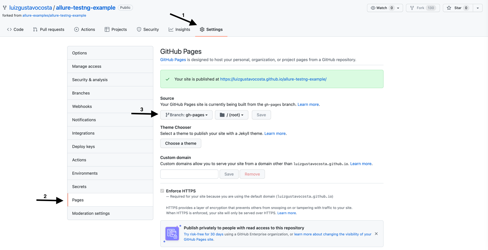
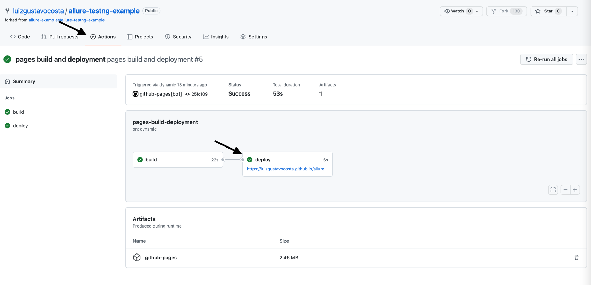
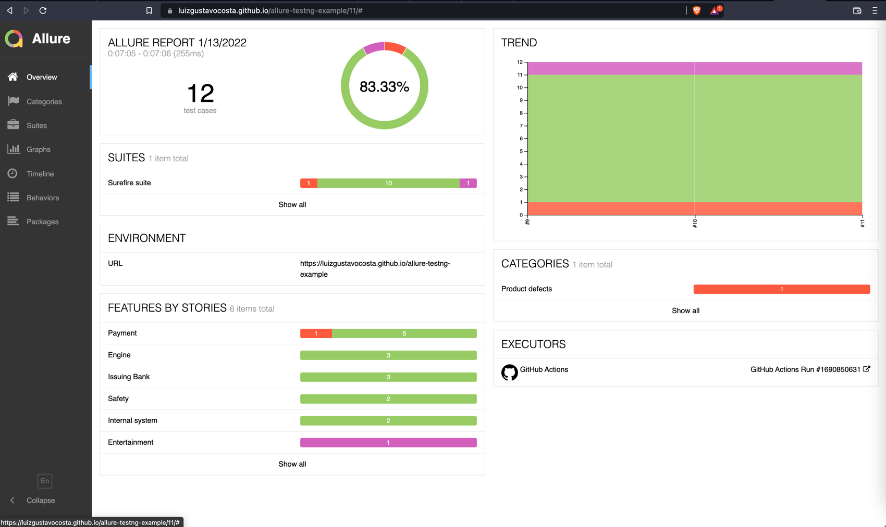

## Allure TestNG Example

### Atenção
:stop_sign: Para fins didático e de exploração do Allure, um teste está falhando :trollface: para que sai com erro no relatório.

### Como iniciar?

Siga os passos abaixo ou acesse diretamente a documentação em inglês [aqui](https://github.com/allure-examples/allure-testng-example).

```bash
$ git clone https://github.com/luizgustavocosta/allure-testng-example.git
$ ./mvnw clean test -Dmaven.test.failure.ignore=true site
```

O :page_facing_up: relatório será gerado na pasta `target/site/allure-maven-plugin`. 
Para abrir via linha de comando o relatório use o comando abaixo

```bash
$ ./mvnw io.qameta.allure:allure-maven:serve
```

Ou use o comando abaixo para gerar e depois abra o arquivo "target/site/allure-maven-plugin/index.html".

```bash
$ ./mvnw io.qameta.allure:allure-maven:report
```

### Use GitHub Actions para adicionar o relatório
Com GitHub Actions, use a action dentro da pasta ```.github/worksflows/allure-testng.yml``` como exemplo.

Dentro do repositório, associe a branche ```gh_pages``` para servir de página do projeto e estará disponível seu relatório no GitHub e gerado com Allure + TestNG + GitHub Actions







### Tech stack
- Java
- Allure
- TestNG
- Maven
- Git
- GitHub Actions
- Conventional Commits